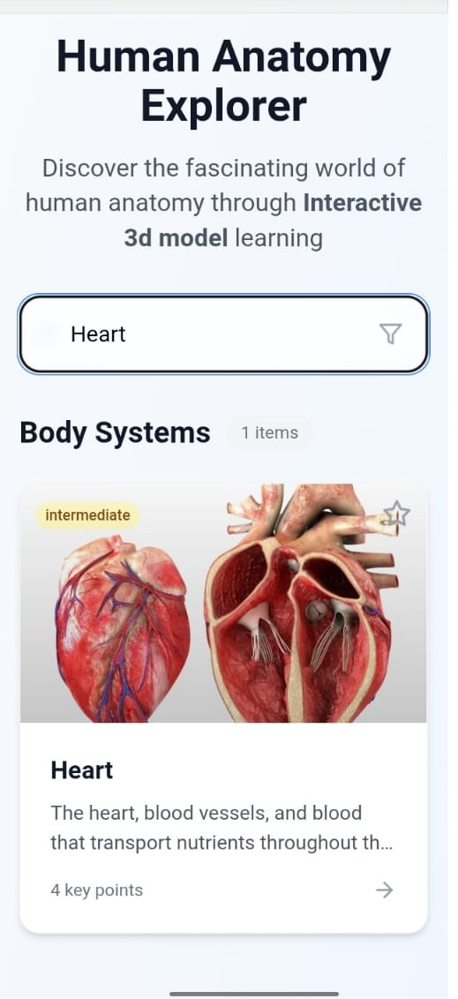
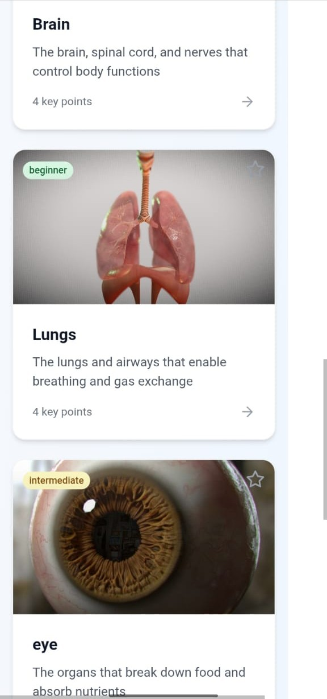
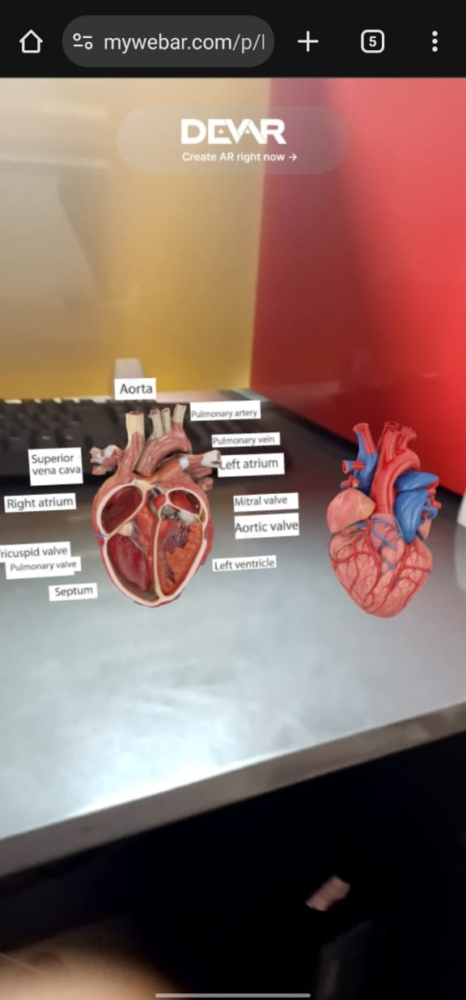
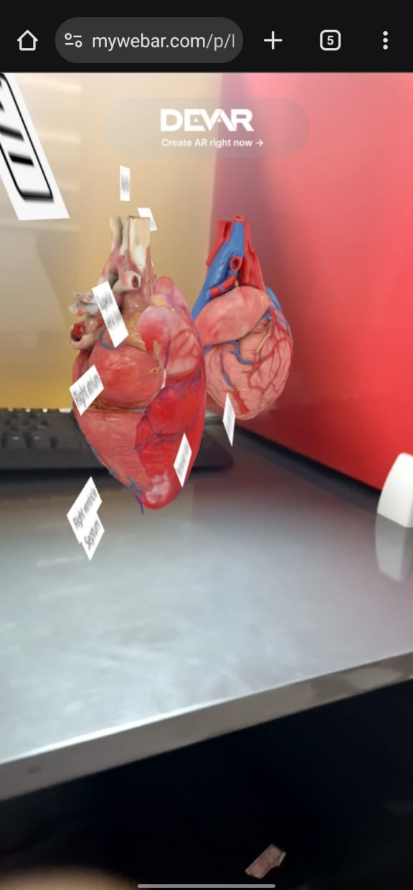

# 🌐 Human Anatomy AR Explorer

*A Final-Year AR Project for Interactive 3D Human Anatomy Learning*

A modern Augmented Reality (AR)–based anatomy learning application that allows users to explore human organs in 3D. Users can tap any organ to view its name, function, animations, and audio descriptions — making learning intuitive and engaging.

---

## 🚀 Features

* 🧍 **Full 3D human body model**
* 🫁 **Tap on any organ** to view:

  * Organ name
  * Function description
  * Animation / simulation
  * Audio narration
* 📱 **AR Mode** (no headset required) — view the anatomy model directly in your environment
* 🎧 **Audio-assisted learning**
* 🖥️ **Clean, responsive UI** built with React + Tailwind
* 🌐 **Live Demo**: [https://arproject-one.vercel.app/](https://arproject-one.vercel.app/)

---

## 🖼️ Screenshots for laptop and mobile view
```md











```

(Just replace the image paths with your own.)

---

## 🛠️ Tech Stack

| Layer               | Technology                                               |
| ------------------- | -------------------------------------------------------- |
| **Frontend**        | React, TypeScript, Vite, Tailwind CSS                    |
| **3D / AR**         | Three.js, WebXR, AR.js (or the one used in your project) |
| **Assets**          | 3D models, textures, audio narrations                    |
| **Deployment**      | Vercel                                                   |
| **Version Control** | Git + GitHub                                             |

---

## 📦 Installation & Run Locally

1. **Clone the repository**

   ```bash
   git clone https://github.com/raj-pandith/finalyearARAnatomyproject2.git
   cd finalyearARAnatomyproject2
   ```

2. **Install dependencies**

   ```bash
   npm install
   ```

3. **Start development server**

   ```bash
   npm run dev
   ```

4. **Open in browser**
   Go to:
   👉 [http://localhost:3000](http://localhost:3000)
   Grant **camera permissions** to test AR mode.

---

## 🎯 Project Goals

* Make anatomy learning interactive and immersive
* Help students visualize organs more clearly than flat diagrams
* Enable hands-on AR exploration without any headset
* Provide audio learning for better accessibility

---

## 📂 Project Structure

```
src/
  assets/        → 3D models, textures, audio files  
  components/    → UI Components  
  scenes/        → AR/Three.js scenes  
  styles/        → Tailwind/CSS  
public/
  index.html
package.json
vite.config.ts
```

---

## 🚧 Future Enhancements

* 🔬 Organ-system filters (Nervous, Digestive, Respiratory, etc.)
* 🌍 Multi-language audio descriptions
* 🎮 VR Mode using WebXR
* 🧠 Quiz mode for learning assessment
* 📱 Mobile performance optimizations (lazy-loading, model compression)

---

## 📜 License

This project is licensed under the **MIT License**.
See the [LICENSE](./LICENSE) file for details.

---

## 👤 Author

**Raj Pandith**
GitHub: [raj-pandith](https://github.com/raj-pandith)

